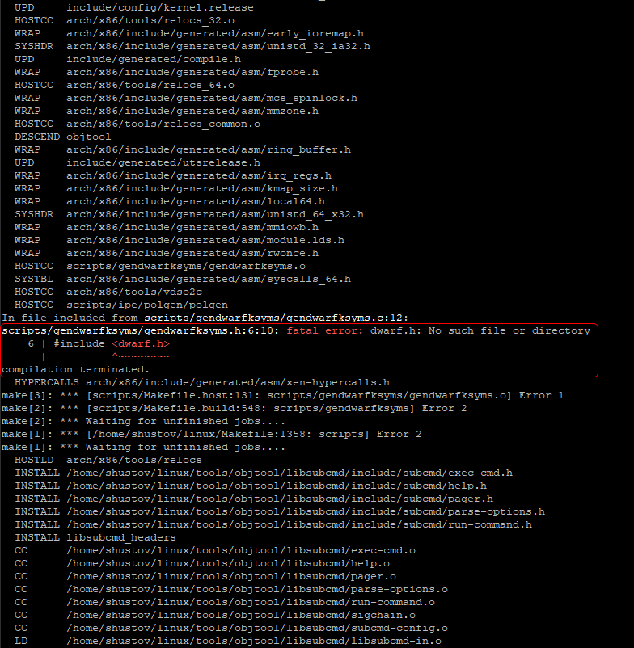
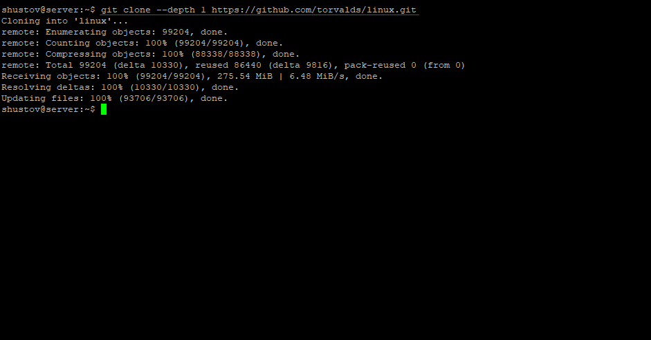
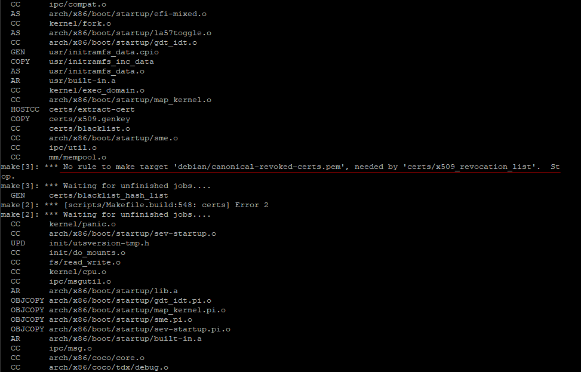
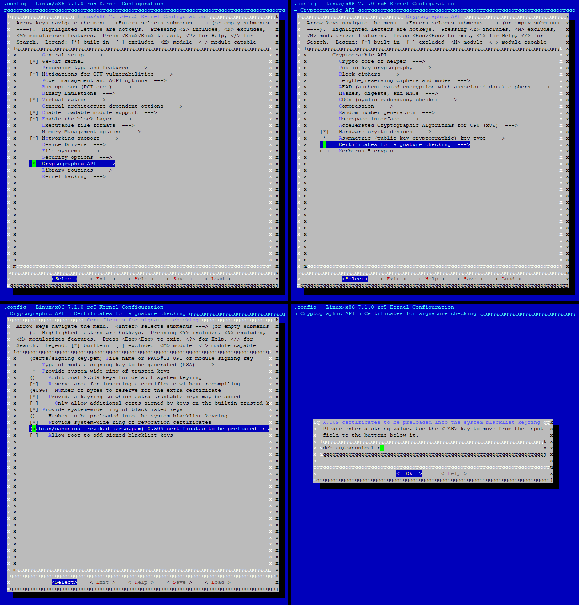
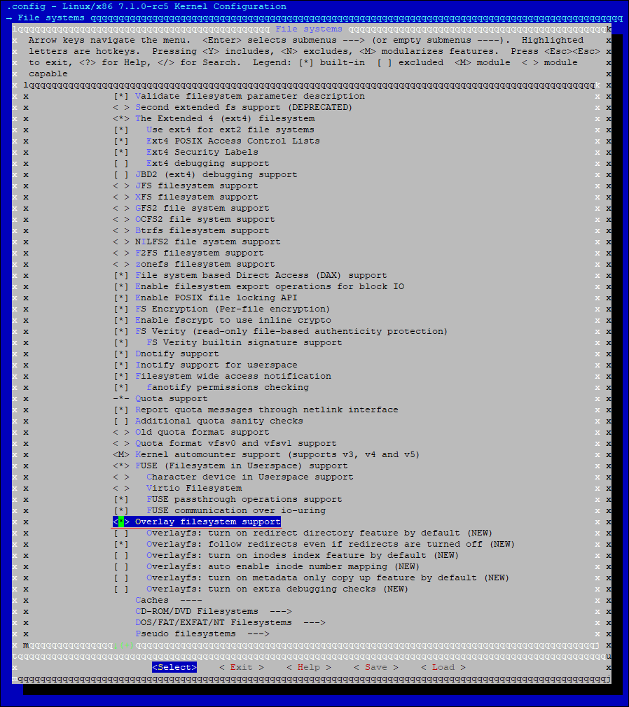
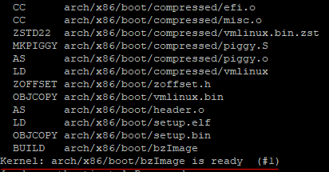
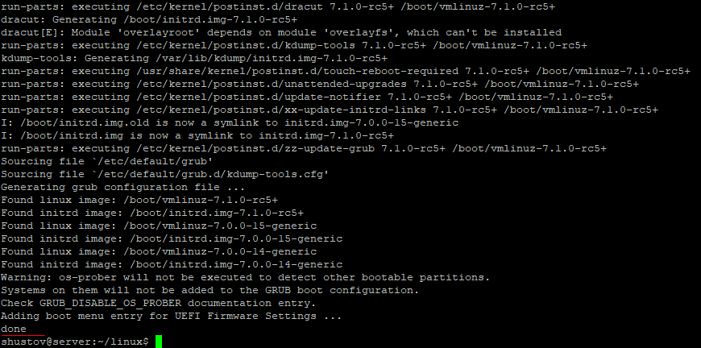
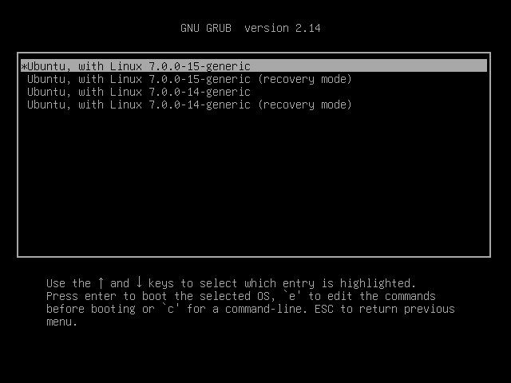
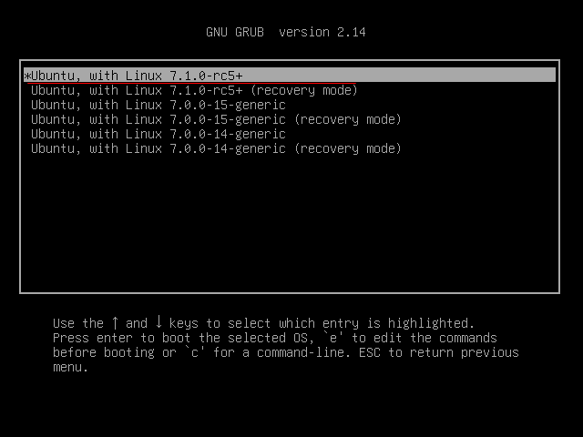

## Установка

Чтобы не рисковать основной системой, я установил **Ubuntu Server** на виртуальную машину. У этого решения оказалось два главных плюса:
* Снапшоты - позволяли мгновенно откатиться назад при ошибках сборки. Пользовался ими постоянно.
* Экономия ресурсов - отсутствие GUI сильно разгрузило оперативную память и процессор, что ускорило компиляцию ядра.

Единственным минусом стала чистая система. Из-за нехватки библиотек сборка то и дело плевалась ошибками.

В процессе их решения я сформировал готовый чек-лист пакетов, необходимых для успешной компиляци:
* **`git`**: гит.
* **`build-essential`**: компиляторы, `make`.
* **`libncurses-dev`**: знакомая нам библиотека для **`make menuconfig`**.
* **`bison`**: генератор парсеров.
* **`flex`**: лексический анализатор. 
* **`libssl-dev`**: заголовочные файлы OpenSSL. 
* **`libelf-dev`**: заголовочные файлы для работы с форматом ELF.
* **`bc`**: калькулятор, который скрипты используют для сборки ядра.
* **`libdw-dev`**: позволяет программам читать отладочную информацию из исполняемых файлов.
* **`libdwarf-dev`**:  для анализа формата DWARF. (особо не разбирался, но при компиляции часто краснил)



```bash
sudo apt update
sudo apt install -y git build-essential libncurses-dev bison flex libssl-dev libelf-dev bc libdw-dev libdwarf-dev
```

## Качаем ядро 
```bash
git clone --depth 1 https://github.com/torvalds/linux.git
```
`--depth 1` - позволяет не качать всю историю, а только полседний комит! что экономит много места! 



## Собираем конфиг.
Через `make defconfig` - собрать ядро никак не получалось попыток было потрачено много, но я всегда что-то упускал из виду, а вот через `make localmodconfig` вполне себе получилось, но опять же не без проблем.

* Не знаю у всех это или нет, но у меня возникала ошибка  ключами безопасности:

Как я понял ядро требует файл со списком ключей безопасности, а этого файла на компьютере нет.И чтобы это испрвить через `make menuconfig` затираем строку:


* Так же у меня возникала ошибка, к сожалению скриншота нет и переустанавливать сервер в сотый раз чтобы показать одну ошибку - не хочется. 
<br>Но если в словах - при установке у меня стояла галочка `LVM` - слой абстракции между диском и файловой системы и без включенного `CONFIG_OVERLAY_FS` компиляция выдавала предупреждение, а при загрузке в ядро писалась ошибка что-то вроде `dracut-initqueue timeout` и потом выкидывало в `emergency mode`, решалось это включенным в конфиг `overlay fs`


**Без LVM - интернет говорит, что ядро напрямую монтирует диск без лишних абстракций, и CONFIG_OVERLAY_FS для ядра больше не нужен.**

## Итоги
И дальше ядро спокойно монтировалось и устанавливалось.
<br>


До установки второго ядра! 
<br>

После установки:
<br>
