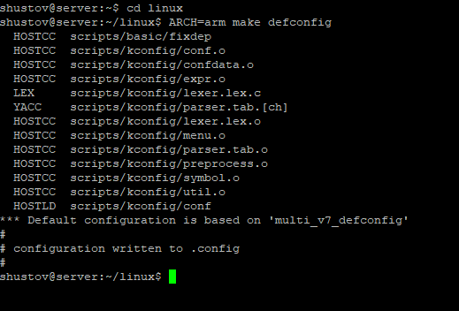
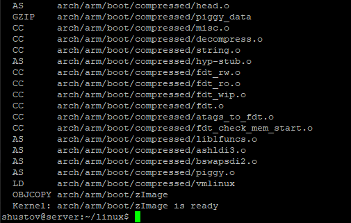
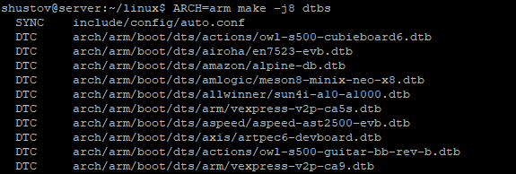
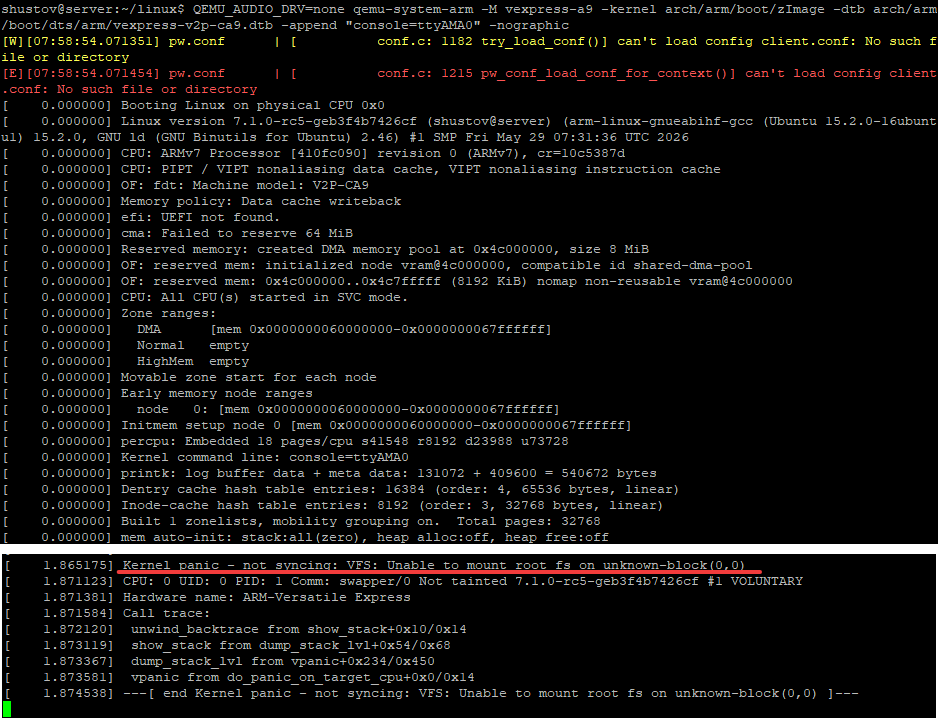

# Кросс компиляция под arm, эмуляция в qemu
## Установка недостающее

По лекции смотрим чего нам не хватает, и ставим:
```bash
sudo apt update
sudo apt install gcc-arm-linux-gnueabihf qemu-system-arm -y
```

## Генерация файла конфигурации

```bash
ARCH=arm make defconfig
```



## Сборка образа ядра

```bash
ARCH=arm CROSS_COMPILE=arm-linux-gnueabihf- make -j8 zImage
```



## Компиляция Device Tree файлов (dts) в бинарный формат (dtb)
```bash
ARCH=arm make -j8 dtbs
```



## Запуск эмуляции

```bash
QEMU_AUDIO_DRV=none qemu-system-arm -M vexpress-a9 -kernel arch/arm/boot/zImage -dtb arch/arm/boot/dts/vexpress-v2p-ca9.dtb -append "console=ttyAMA0" -nographic
```



В начале мы можем видеть ошибки при запуске эмулятора:
```
[W][07:58:54.071351] pw.conf      | [          conf.c: 1182 try_load_conf()] can't load config client.conf: No such file or directory
[E][07:58:54.071454] pw.conf      | [          conf.c: 1215 pw_conf_load_conf_for_context()] can't load config client.conf: No such file or directory
```
Но эти ошибки никак не влияют на работу эмулятора. Насколько я понял, то эти строки выводит звуковая программа `PipeWire`. При запуске `qemu` автоматически подтягивает библиотеку `PipeWire`, а она при инициализации уже отдельно сама ищет файлы, не находит и пишет об этом!

И далее сообщение: `Kernel panic - not syncing: VFS: Unable to mount root fs on unknown-block(0,0)`, ошибка монтажа файловой системы, как и на лекции.