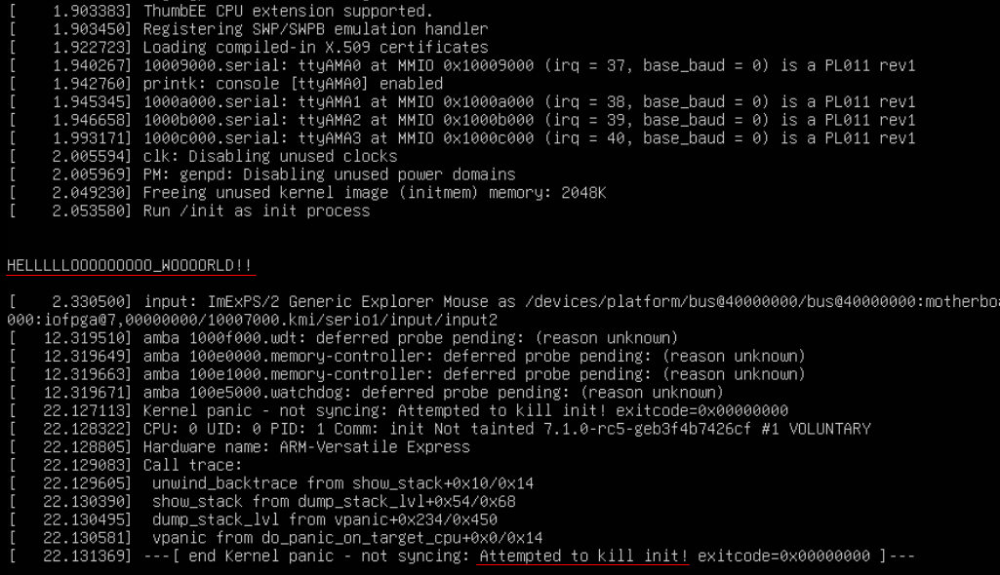
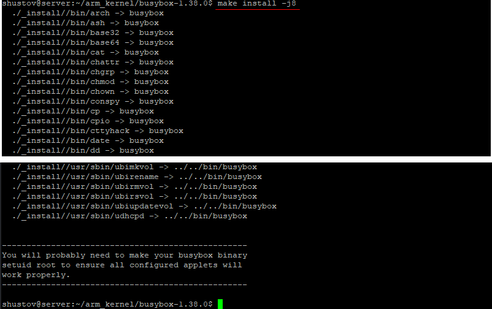
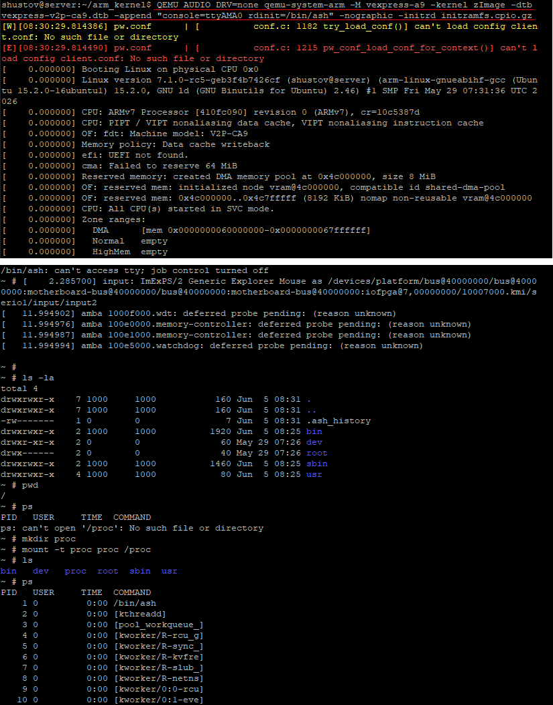

# Подключаем файловую систему
## hello.c
Подключаем систему коммандой из документации, но компилируем под arm - `arm-linux-gnueabihf-gcc`
```bash
cat > hello.c << EOF
#include <stdio.h>
#include <unistd.h>
int main (void){
	printf("\n\nHELLLLLOOOOOOOOO_WOOOORLD\n\n!!");
	sleep(20);
} 
EOF
arm-linux-gnueabihf-gcc -static hello.c -o init
echo init | cpio -o -H newc | gzip > initramfs.cpio.gz 
QEMU_AUDIO_DRV=none qemu-system-arm -M vexpress-a9 -kernel zImage -dtb vexpress-v2p-ca9.dtb -append "console=ttyAMA0" -nographic -initrd initramfs.cpio.gz
```



---

## busyBox
### Качаем busybox
Находим ссылку на актуальную сборку busybox: https://busybox.net/downloads/busybox-1.38.0.tar.bz2, и качаем через `wget`.
Распаковываем, и заходим внутрь
```bash
wget https://busybox.net/downloads/busybox-1.38.0.tar.bz2 
tar -xf busybox-1.38.0.tar.bz2 
cd busybox-1.38.0
```

### .config
Работаем с конфигом, говорим что будем компилировать статически, и указываем параметры сборщика `arm-linux-gnueabihf-`
```bash
ARCH=arm make defconfig
ARCH=arm make menuconfig
```


### Сборка, проверка, установка

Собираем, проверяем
```bash
make -j8
file busybox
```


```bash
make install
cd _install
find . -not -name "initramfs.cpio.gz" | cpio -o -H newc | gzip > initramfs.cpio.gz
```
Копируем архив в папку с ядром и dtb




### Эмуляция
Дополнительно указываем `initrd initramfs.cpio.gz` и `rdinit=/bin/ash`
```bash
QEMU_AUDIO_DRV=none qemu-system-arm -M vexpress-a9 -kernel zImage -dtb vexpress-v2p-ca9.dtb -append "console=ttyAMA0 rdinit=/bin/ash" -nographic -initrd initramfs.cpio.gz
```
