# Задание 19: Кросс-компиляция (Сборка OpenSSH и запуск в эмуляторе)

Небольшое предисловие. Изначально я хотел фиксировать каждый шаг и скриншотить все ошибки. Однако проблем оказалось так много, что описание нескольких дней мучений заняло бы больше времени, чем выполнение самого задания.

Поэтому я просто поделюсь работающими командами и кратко опишу, с какими трудностями столкнулся.

---

## Подготовка
Мы знаем что нам понадобится `openssh`, `openssl`, `zlib`. Версии в install `openssh` были указаны старые и выше, поэтому не сильно заморачиваясь я скачал последние версии всех пакетов. 

```bash
git clone https://github.com/openssh/openssh-portable.git
git clone https://github.com/openssl/openssl.git
git clone https://github.com/madler/zlib.git

# Ну и если надо то качаем busybox сразу распаковываем, но у меня он уже есть, поэтому эти команды мы пропускаем
wget https://busybox.net/downloads/busybox-1.38.0.tar.bz2
tar -xf busybox-1.38.0.tar.bz2
```

Ядро, `.dtb` и `busybox` остались с прошлых заданий - их и копируем в новую папку. И получаем следующее:

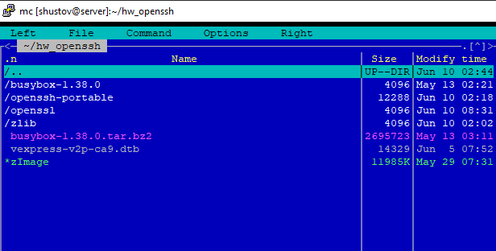

---

## Собираем zlib

Про `-j$(nproc)` я узнал совсем недавно, по началу пользовался, но я настолько долго делал это задание, что просто сформировал списко команд, которые в итоге заработали, и везде его копипастил.

```bash
#/home/shustov/hw_openssh/zlib

./configure --prefix=$PWD/_install --static
make CC=arm-linux-gnueabihf-gcc -j$(nproc) && make install -j$(nproc)
```

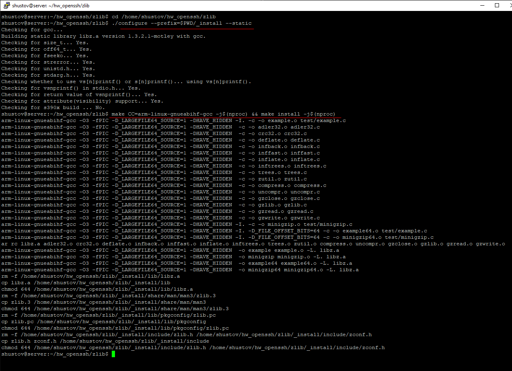

---

## Собираем OpenSSL
Оказывается что префикс тут как в `busybox` и `zlib` указывать нелья, особенно на поздних версиях, все эти пути будут зашиты в бинарник, если мы сделаем префикс `=_install` то на конечной машине он будет искать и файлы конфигурации и остальное - именно по этому пути, которого может и не быть! 
Поэтому мы указывать папку для билда будем через `make  DESTDIR=`

Так же на поздних версиях `OpenSSL` чтобы собрать его статически - не достаточно просто указать `-static`, надо ещё явно указать `no-shared`, но как оказалось позже и этого было мало. Путём получения горького опыта добавляем ещё `no-module`

Ну и префикс компилятора указать было недостаточно, он ещё требует указать систему. Ну согласно документации мы можем узнать список систем через `./Configure list`, далее ищем что-то похожее на `arm` и находим только `linux-armv4`. Спрашиваем интернет, и он говорит, что это то, что нам нужно!

```bash
# /home/shustov/hw_openssh/openssl

./Configure linux-armv4 \
    --cross-compile-prefix=arm-linux-gnueabihf- \
    --prefix=/usr \
    --openssldir=/etc/ssl \
    no-shared \
    no-module \
    -static
```

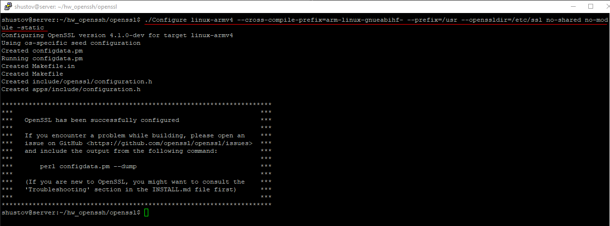

Ну и через `DESTDIR=$PWD/_install` - говорим куда билдить

```bash
make -j$(nproc) && make install DESTDIR=$PWD/_install -j$(nproc)
```

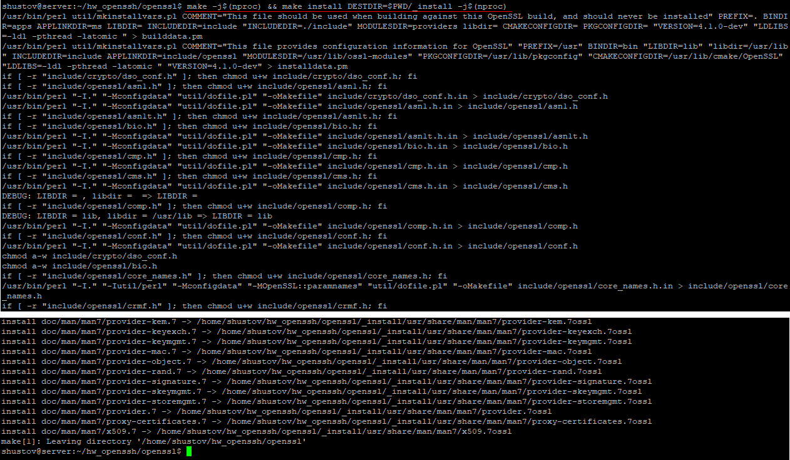

---

## Собираем OpenSSH
Ну конечно и тут нас встречают проблемы, в свежескачанном репозитории нет ни `configure` ни `make`, но есть `configure.ac` который предварительно прогоняется через `autoreconf`, я так понимаю что это и есть `autotools`. 
<br>Ну чтож качем `autoconf` и запускаем `autoreconf` и через флаг -i докачиваем недостающее.

```bash
sudo apt install autoconf
autoreconf -i
```

Затем те же танцы с бубнами как и в `OpenSSL`, все что мы напишем в префикс зашьётся в бинарник, поэтому `_install` мы указать не можем.

`INSTALL=...-strip-program=arm-linux-gnueabihf-strip` означает, что при `make install` `OpenSSH` будет использовать команду `install` с дополнительной очисткой бинарников. Зачем? Потому что без этого у меня возникали ошибки при попытке сделать `install`. Я так понимаю, что после сборки файлы будут устанавливаться и сразу чиститься от лишней отладочной информации через arm-linux-gnueabihf-strip. Звучит как что-то не критичное, но без этого ничего не получалось.

Остальное в целом понятно.

```bash
# /home/shustov/hw_openssh/openssh-portable

./configure --host=arm-linux-gnueabihf \
    --prefix=/usr \ 
    --sysconfdir=/etc/ssh \ 
    --with-zlib=$PWD/../zlib/_install \
    --with-ssl-dir=$PWD/../openssl/_install/usr \
    LDFLAGS="-static" \
    INSTALL="/usr/bin/install -c --strip-program=arm-linux-gnueabihf-strip"
```
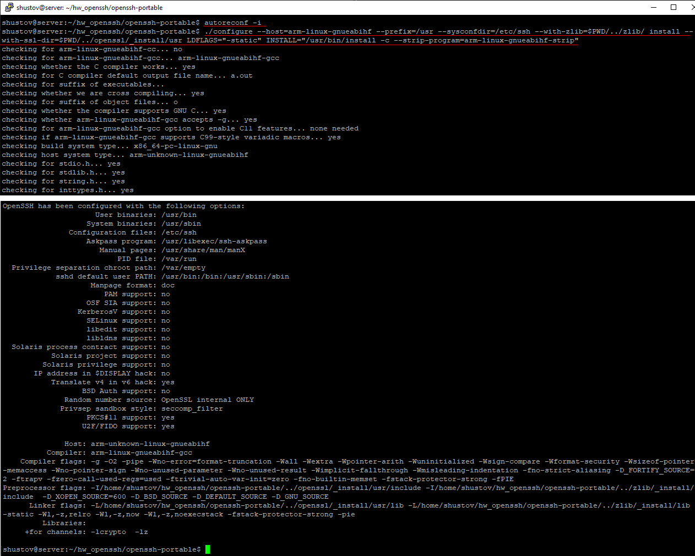

Ну и в `make` все так же делаем `install DESTDIR=`

```bash
make -j$(nproc) && make install DESTDIR=$PWD/_install -j$(nproc)
```

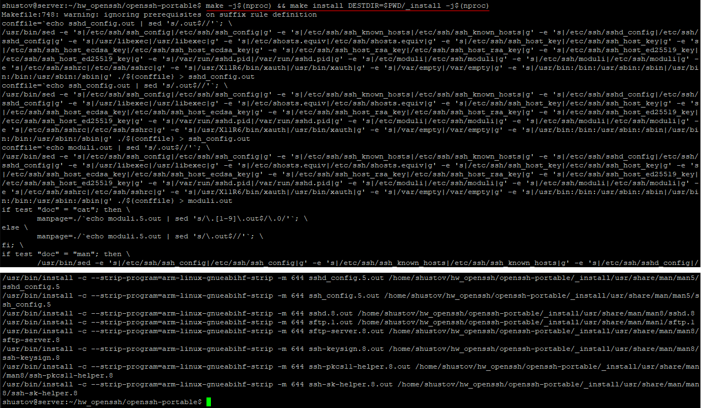

---

## Настройка busybox
Тут все более менее предсказуемо

```bash

# /home/shustov/hw_openssh/busybox-1.38.0

ARCH=arm make defconfig -j$(nproc)
ARCH=arm make menuconfig
```

В menuconfig:
```
Settings
    + Build static binary (no shared libs)
    Cross compiler prefix = arm-linux-gnueabihf-
Networking Utilities
    - tc
```
Я в прошлом задании не описыва это, но у меня там тоже возникала ошибка, если я не отключал `tc`, поэтму в Сетевых утилитах убираем звёздочку с `tc`

Делаем `make` проверяем и устанавливаем:
```bash
make -j$(nproc)
file busybox
make install
```

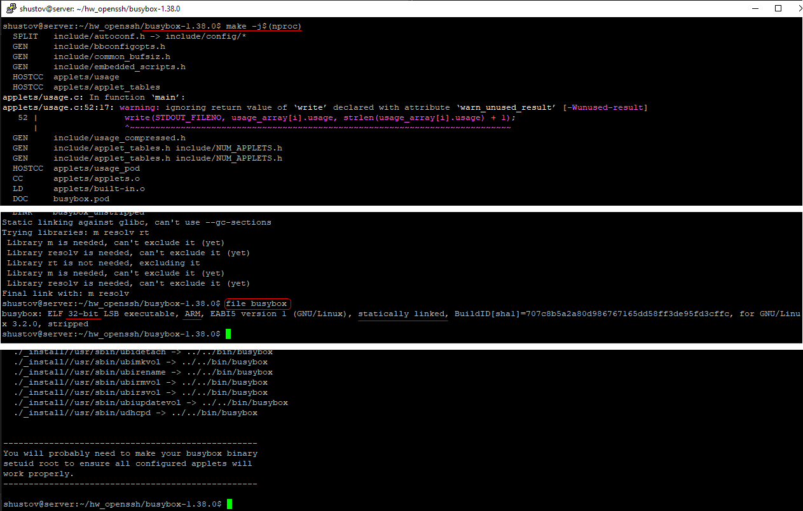


### Подготовка initramfs
Не отходя от кассы, создаём папки нужные, которые могут потребоваться, и добавляем пользователя. через файлы `passwd`, `group` и `shadow` - он пустой, но тоже нужен оказался.
```bash
# /home/shustov/hw_openssh/busybox-1.38.0

mkdir -p _install/etc _install/root _install/dev _install/proc _install/sys _install/tmp _install/usr/bin

cat > _install/etc/passwd <<'EOF'
root:x:0:0:root:/root:/bin/sh
EOF

cat > _install/etc/group <<'EOF'
root:x:0:
EOF

touch _install/etc/shadow
```
Я так же пробовал добавлять пользователя через `adduser` - от самой `busybox`, но он создаёт пользователя с `id==1000`, а `ssh` требует чтобы `id==0`, но кто я такой чтобы спорить с ядром, просот дам ему того чего оно желает! 

Копируем бинарник `ssh` в `busybox.. /_install` 

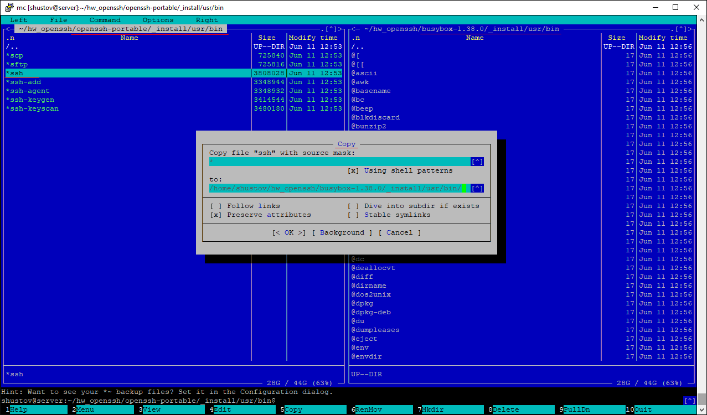

Проверяем что скомпилировалось под нашу систему
```bash
file _install/usr/bin/ssh
``` 

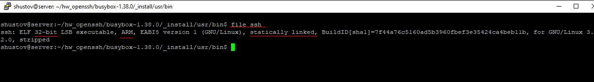

### Подготовка устройств и ссылок

mkdir -p dev просто создает папку dev, если ее еще нет. 
<br>mknod dev/null c 1 3 создает внутри нее специальный системный файл dev/null. Как я понял это "устройство", в которое программы могут "выбрасывать" ненужный вывод. ssh ожидает, что такой файл существует, и без него ругается.
```bash
# /home/shustov/hw_openssh/busybox-1.38.0/_install

mkdir -p dev
mknod dev/null c 1 3
```

## Упаковка initramfs
```bash
find . | cpio -o -H newc | gzip > ../../initramfs.cpio.gz
```

Так выглядит папка после всех приготовлений:

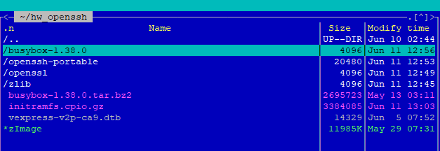

## Эмуляция, и запуск ssh
Тут все просто:
```bash
# /home/shustov/hw_openssh

QEMU_AUDIO_DRV=none qemu-system-arm -M vexpress-a9 -kernel zImage -dtb vexpress-v2p-ca9.dtb -append "console=ttyAMA0 rdinit=/bin/ash" -nographic -initrd initramfs.cpio.gz
```

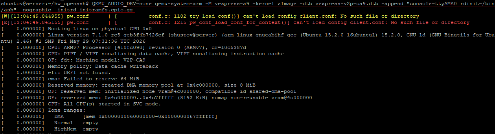

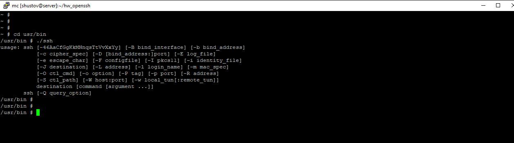
