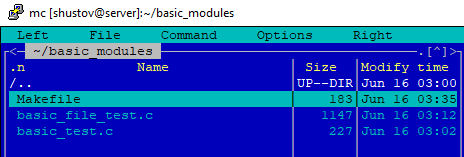

# Задание 20_1: Модули ядра

Делал все на голом дебиане, как и прошлые задания по эмуляции ядра с файловой системой, и проблем как у ребят которые сидят на mint - не возникло никаких. 
Времени на знакоство со статьёй по аписанию модуля нет, поэтому особо не углублялся, и ориентировался только на лекцию.


## Подготовка
Создаём `Makefile` и два модуля - `basic_module` и `basic_file_module`
С кодом почти дословно спёртым из лекции:

```Makefile
obj-m += basic_test.o
obj-m += basic_file_test.o
all:
	make -C /lib/modules/7.0.0-22-generic/build M=$(PWD) modules
clean:
	make -C /lib/modules/7.0.0-22-generic/build M=$(PWD) clean
```

```c
#include <linux/module.h>
#include <linux/kernel.h>

int init_module(void)
{
	pr_info("My test module loaded!!!\n");
	return 0;
}

void cleanup_module(void)
{
	pr_info("My test module unloaded!!!\n");
}

MODULE_LICENSE("GPL");
```

```c
#include <linux/module.h>
#include <linux/kernel.h>
#include <linux/fs.h>
#include <linux/uaccess.h>
#include <linux/rwlock.h>

static int major = 0;
static rwlock_t lock;
static char test_string[15] = "Hello!\n";

static ssize_t test_read(struct file *fd, char __user *buff, size_t size, loff_t *off)
{
	size_t rc;

	read_lock(&lock);
	rc = simple_read_from_buffer(buff, size, off, test_string, 15);
	read_unlock(&lock);

	return rc;
}

static ssize_t test_write(struct file *fd, const char __user *buff, size_t size, loff_t *off)
{
	size_t rc = 0;

	if (size > 15)
		return -EINVAL;

	write_lock(&lock);
	rc = simple_write_to_buffer(test_string, 15, off, buff, size);
	write_unlock(&lock);

	return rc;
}

static struct file_operations fops = {
	.owner = THIS_MODULE,
	.read = test_read,
	.write = test_write
};

int init_module(void)
{
	pr_info("test module is loaded.\n");
	rwlock_init(&lock);

	major = register_chrdev(major, "basic_file_test", &fops);
	if (major < 0)
		return major;

	pr_info("Major number is %d.\n", major);
	return 0;
}

void cleanup_module(void)
{
	unregister_chrdev(major, "basic_file_test");
}

MODULE_LICENSE("GPL");

```




## Базовый модуль
Тут тоже все просто, на удивление никаких ошибок и каких либо ядерных выкрутасов


Листинг:
```bash
make
sudo insmod basic_test.ko
sudo dmesg | tail -n 5
lsmod | grep basic_test
sudo rmmod basic_test
sudo dmesg | tail -n 5
```

## 2 Файл устройства
Тут в программе для скриншотов я открыл для себя маркер-выделяльщик ! :)


Листинг:
```bash
make clean
make
sudo insmod basic_file_test.ko
sudo dmesg | tail -n 5
sudo mknod /dev/basic_file_test c <major> 0
sudo chmod +666 /dev/basic_file_test
cat /dev/basic_file_test
echo "good_bye!" > /dev/basic_file_test
echo -n "good_bye!" > /dev/basic_file_test
cat /dev/basic_file_test
sudo rm /dev/basic_file_test
sudo rmmod basic_file_test
```