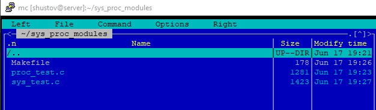
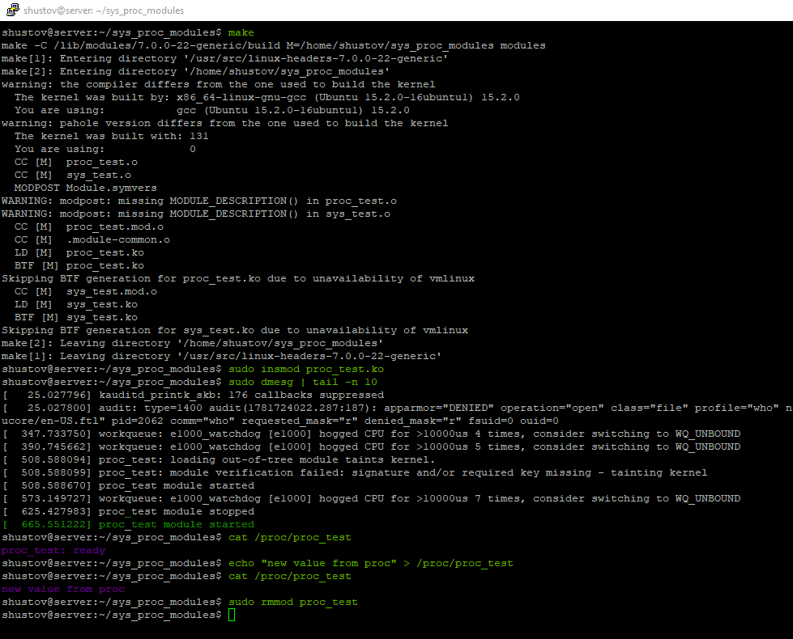
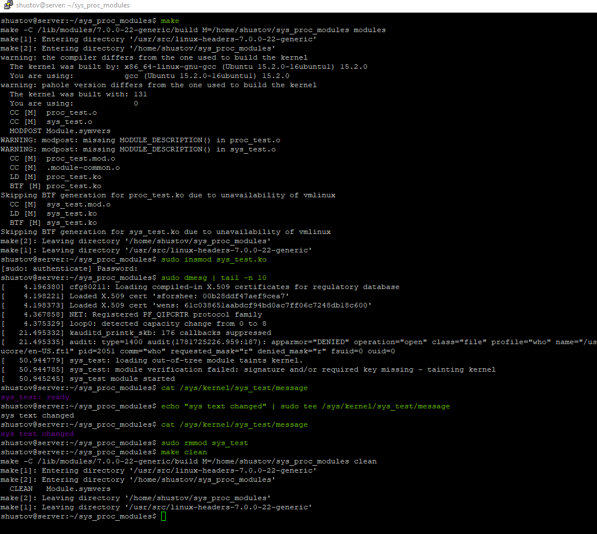

# Задание 20_1: Модули ядра proc/sys



Makefile общий для всех
```Makefile
obj-m += proc_test.o
obj-m += sys_test.o

all:
        make -C /lib/modules/7.0.0-22-generic/build M=$(PWD) modules

clean:
        make -C /lib/modules/7.0.0-22-generic/build M=$(PWD) clean

```

## proc


Листинг:
```c
//home/shustov/sys_proc_modules/proc_test.c
#include <linux/module.h>
#include <linux/kernel.h>
#include <linux/proc_fs.h>
#include <linux/string.h>
#include <linux/uaccess.h>

static struct proc_dir_entry *proc_test_entry = NULL;
static char proc_test_buffer[64] = "proc_test: ready\n";

static ssize_t proc_test_read(struct file *file, char __user *buff, size_t size, loff_t *off)
{
        return simple_read_from_buffer(buff, size, off, proc_test_buffer, strlen(proc_test_buffer));
}

static ssize_t proc_test_write(struct file *file, const char __user *buff, size_t size, loff_t *off)
{
        size_t written;

        if (size >= sizeof(proc_test_buffer))
                return -EINVAL;

        written = simple_write_to_buffer(proc_test_buffer, sizeof(proc_test_buffer) - 1, off, buff, size);
        if ((ssize_t)written < 0)
                return written;

        proc_test_buffer[written] = '\0';
        return written;
}

// Для новых ядер:
static const struct proc_ops proc_test_ops = {
        .proc_read = proc_test_read,
        .proc_write = proc_test_write,
};

int init_module(void)
{
        pr_info("proc_test module started\n");

        proc_test_entry = proc_create("proc_test", 0666, NULL, &proc_test_ops);
        if (!proc_test_entry)
                return -ENOMEM;

        return 0;
}

void cleanup_module(void)
{
        proc_remove(proc_test_entry);
        pr_info("proc_test module stopped\n");
}

MODULE_LICENSE("GPL");
```

Использованные команды
```bash
make
sudo insmod proc_test.ko
sudo dmesg | tail -n 10
cat /proc/proc_test
echo "new value from proc" > /proc/proc_test
cat /proc/proc_test
sudo rmmod proc_test
make clean
```
## sys



Листинг:
```c
//home/shustov/sys_proc_modules/sys_test.c
#include <linux/module.h>
#include <linux/kernel.h>
#include <linux/kobject.h>
#include <linux/string.h>
#include <linux/sysfs.h>

static struct kobject *sys_test_kobj = NULL;
static char sys_test_buffer[64] = "sys_test: ready\n";

static ssize_t message_show(struct kobject *kobj, struct kobj_attribute *attr, char *buf)
{
        return scnprintf(buf, PAGE_SIZE, "%s", sys_test_buffer);
}

static ssize_t message_store(struct kobject *kobj, struct kobj_attribute *attr, const char *buf, size_t count)
{
        size_t copy_size = min(count, sizeof(sys_test_buffer) - 1);

        memcpy(sys_test_buffer, buf, copy_size);
        sys_test_buffer[copy_size] = '\0';

        return count;
}

static struct kobj_attribute message_attribute =
        __ATTR(message, 0664, message_show, message_store);

static struct attribute *sys_test_attrs[] = {
        &message_attribute.attr,
        NULL,
};

static struct attribute_group sys_test_group = {
        .attrs = sys_test_attrs,
};

int init_module(void)
{
        int retval;

        pr_info("sys_test module started\n");

        sys_test_kobj = kobject_create_and_add("sys_test", kernel_kobj);
        if (!sys_test_kobj)
                return -ENOMEM;

        retval = sysfs_create_group(sys_test_kobj, &sys_test_group);
        if (retval) {
                kobject_put(sys_test_kobj);
                return retval;
        }

        return 0;
}

void cleanup_module(void)
{
        sysfs_remove_group(sys_test_kobj, &sys_test_group);
        kobject_put(sys_test_kobj);
        pr_info("sys_test module stopped\n");
}

MODULE_LICENSE("GPL");
```

Использованные команды:
```bash
make
sudo insmod sys_test.ko
sudo dmesg | tail -n 10
cat /sys/kernel/sys_test/message
#Пришлось использовать tee из за недостаточных прав доступа
echo "sys text changed" | sudo tee /sys/kernel/sys_test/message
cat /sys/kernel/sys_test/message
sudo rmmod sys_test
make clean
```


