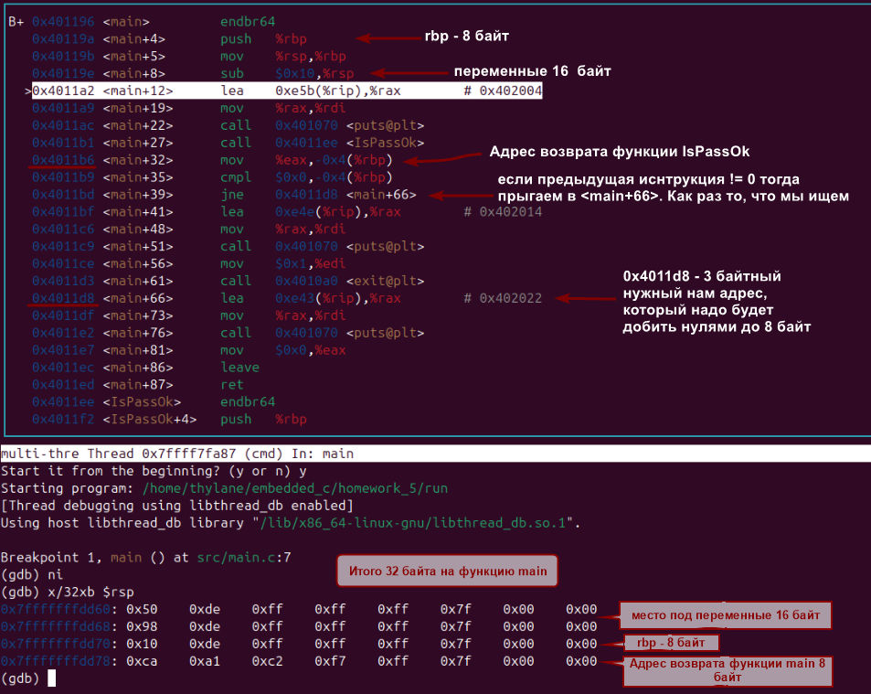
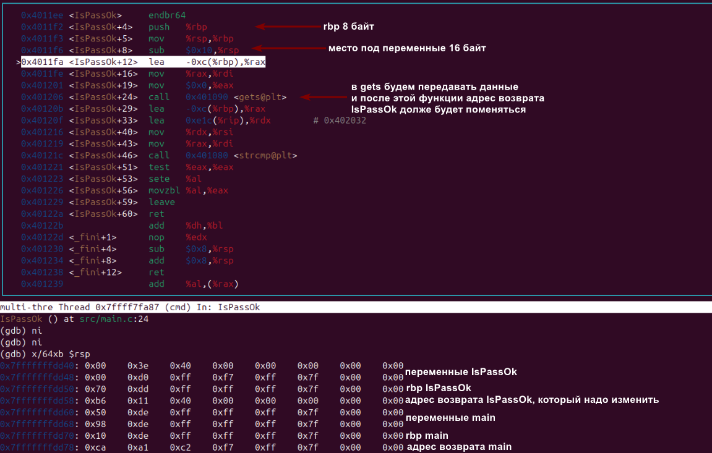
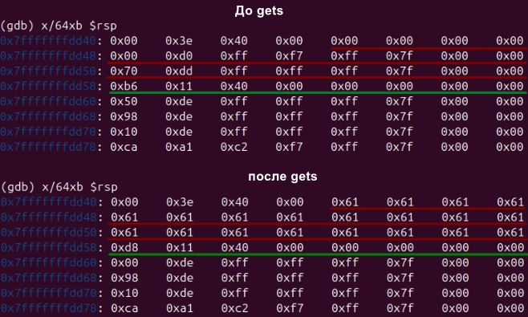
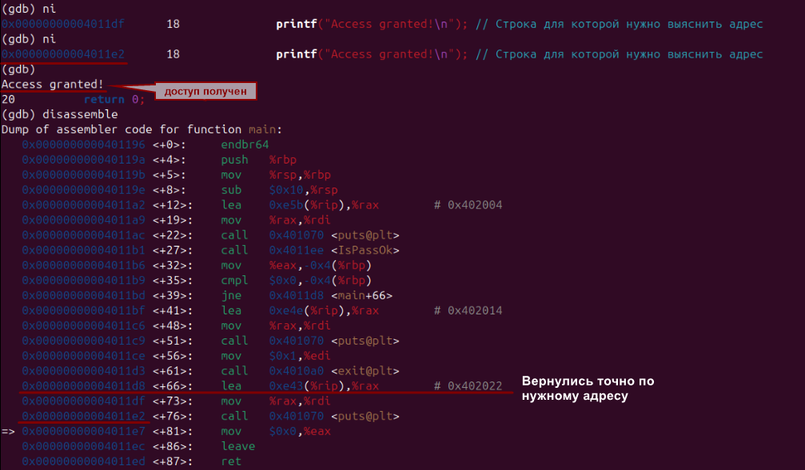
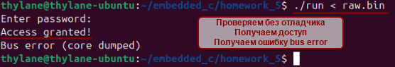

# Начальные приготовления
Сначала компилируем программу с отладчиком: `gcc -g -fno-stack-protector -no-pie src/main.c -o run`
1. Запускаем отладчик:
   `gdb run`
2. Ставим точку останова на main:
   `b *main`
   (у меня если я запускаю с `main` я перепрыгиваю через формирование кадра функции, а вот с  `\*main` мы стартуем прям с самого верха функции)
3. Запускаем отладку:
   `r` 
4. Настраиваем layout 
   `la asm` - окно просмотра ассемблерного кода
   `fs cmd` - смещаем фокус на консоль
5. Начинаем анализ кода!

# Ассемблерный код функции main
1. Мы знаем что кадр формируется с аргументов, потом идёт адрес возврата.
   Аргументов нет, но есть 8 байтный адрес возврата, далее в стек добавляем `rbp` и инициализируем переменные! 
   В функции `main` - одна интовая переменная, но почему мы выделяем 16 байт я так и не понял! 

   Итого 8 байт адрес возврата, 8 байт `rbp` и 16 байт под переменные - 32 байта на функцию `main`! 
2. Далее ищем где вызывается функция `IsPasOk`, и следующий адрес - адрес возврата, запомним его для сравнения: `0x4011b6`
3. Ищем условие, находим - `jne` если функция не равна нулю тогда падаем в блок else   когда источника, то что нам нужно. 
Отладчик пишет что упадём мы на `<main+66>`
	1. Смотрим на строку `<main+66>` и видим адрес, на который нам надо будет вернуться. Записываем его: `0x4011d8`, адрес 3 байтный, нам надо будет допить его ещё 5 нулями! 
4. Далее встаём на функцию `IsPassOk` и заходим с помощью команды `si`

# Ассемблерный код функции IsPassOk
1. Мы знаем что к 32 байтам функции `main` в стек положили ещё 8 байт адреса возврата
2. Далее 8 байт `push rbp`
3. И 16 байт на переменные, вот тут я понимаю почему 16, потому что массив 12 байт, нам надо выровнять его, ближайший размер - 16 
4. Итого 8+8+16 = 32, 32 байта на функцию `IsPassOk` + 32 байта функции `main` - 64 байта - два кадра двух функций.
Пишем `x/64xb $rsp` и сравниваем. Обращаем внимание на адрес возврата функции `IsPassOk`
5. `rsp` - верх стека смотрим сверху вниз и нас интересует 4 строка потому что:
     2 строки под аргумет
     1 строка под rbp
     1 строка под адрес возврата 
 И там мы видим `0xb6 0x11 0x40 0x00 0x00 0x00 0x00 0x00` что совпадает с нашим адресом из `main` - `0x4011b6` его нам и надо подменить!

# Меняем адрес
1. Надо сначала понять какого размера массив, и сколько байт надо перезаписать. Если рассуждать логически, то нам дали 16 байт под переменные и 8 байт под `rbp` значит перезаписывать нужно 24 байта, но нет. Путём проб и ошибок понимаю что хоть нам и дали 16 байт под массив, но мы не можем заполнить первые 4 байта массива (почему, я так и не понял. Думал может быть  эти 4 байта - это указатель на массив, но работаю я в 64 разрядной системе, а указатель там весит 8 байт). По итогу выясняли что нам можно перезаписать 12 байт массива и  8 байт `rbp` - 20 байт можно забить мусором и остальные нам надо забить адресом в формате *little indian*  заполняя пустые адреса нулями: `0x4011d8` - `0xd8 0x11 0x40 0x00 0x00 0x00 0x00 0x00`.
2. Немного погуглив выяснил что бинарник можно создать терминальной функцией printf, так и поступил, оно выходит быстрее чем писать функцию с `fwrite`. и то что можно создать бинарник через который мы можем работать с сырыми байтами.
   В терминале пишем `printf 'aaaaaaaaaaaaaaaaaaaa\xd8\x11\x40\x00\x00\x00\x00\x00' > raw.bin` 
3. Запускаем `gdb`, только теперь при запуске отладки пишем `(gdb) r < raw.bin` , будем в функцию `gets` передавать байты из файла! 
4. Идём в `IsPassOk` сравниваем значения до `gets` и после. И видим 
  
5. Вроде все встало как надо. Идём проверять! 

# Доступ получен!
1. Грузимся в отладчике с `(gdb) r < raw.bin` только без `layout` , с ним как - то всё баговано выводится в терминал, поэтому через `disassemble`  и видим, что мы прыгнули в нужное место, и нам выводится в консоль **Acces granted!**
   
2. Проверим без отладки в терминале, все работает, доступ есть! 
   
